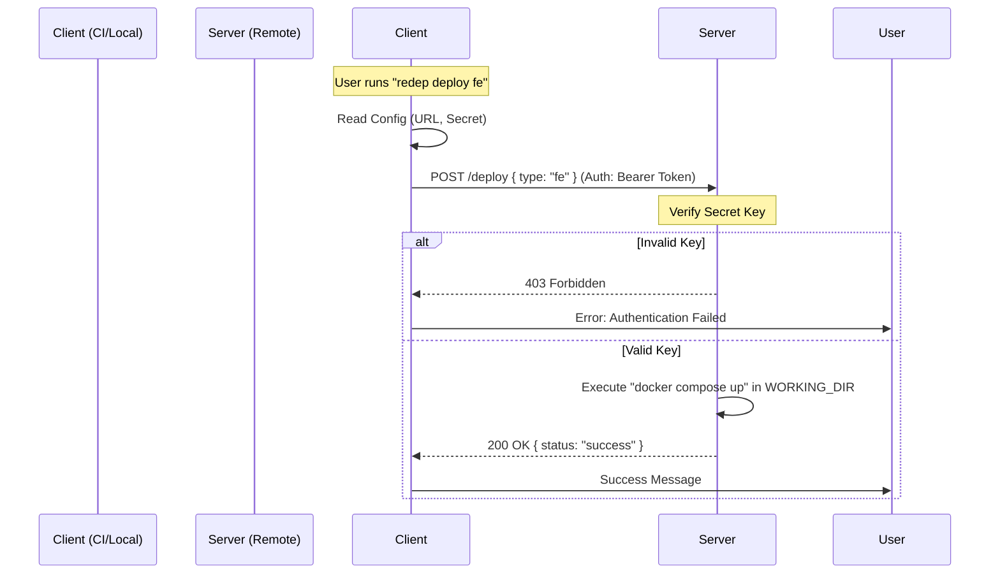

# redep (Remote Deploy CLI)

> A lightweight, secure Node.js CLI tool for remote execution using a Client-Server architecture. Designed to simplify deployment workflows by triggering commands (like Docker Compose) on remote servers securely.


**Last Updated:** 2026-01-17

## Table of Contents

- [Description](#description)
- [Architecture Overview](#architecture-overview)
- [Installation](#installation)
- [Client Commands](#client-commands)
  - [deploy](#deploy)
  - [Client Configuration](#client-configuration)
- [Server Commands](#server-commands)
  - [listen](#listen)
  - [start (Background)](#start-background)
  - [Server Configuration](#server-configuration)
- [Command Interactions](#command-interactions)
- [Configuration Reference](#configuration-reference)
- [Troubleshooting](#troubleshooting)
- [License](#license)

---

## Description

**redep** allows you to securely trigger deployment scripts on a remote server from your local machine or CI/CD pipeline.

## Architecture Overview

1.  **Server (Remote Machine)**: Runs the listener process (`redep listen`). It waits for authenticated HTTP requests and executes local shell commands (e.g., `docker compose up`).
2.  **Client (Local Machine/CI)**: Sends commands (`redep deploy`) to the Server URL.

---

## Installation

### Global Installation (Recommended)

To use `redep` as a command-line tool anywhere on your system:

```bash
npm install -g remote-deploy-cli
```

### Local Installation

If you prefer to use it within a specific project (e.g., via `npm scripts`):

```bash
npm install remote-deploy-cli --save-dev
```

---

## Client Commands

These commands are executed on your **local machine** or **CI/CD runner**.

### `deploy`

Triggers a deployment on the remote server.

**Syntax:**
```bash
redep deploy <type>
```

**Parameters:**
- `<type>`: The service type to deploy. Currently supports `fe` (frontend).

**Requirements:**
- `SERVER_URL` must be configured.
- `SECRET_KEY` must match the server's key.

**Example:**
```bash
# Deploy frontend service
redep deploy fe
```

**Expected Output:**
```
[INFO] Deploying fe to http://192.168.1.50:3000...
[SUCCESS] Deployment triggered successfully.
```

### Client Configuration

Configure the client to know where the server is.

```bash
# Set Server URL
redep config set server_url http://<server-ip>:3000

# Set Secret Key
redep config set secret_key my-secret-key
```

---

## Server Commands

These commands are executed on the **remote server** (VPS, VM, etc.).

### `listen`

Starts the server in the foreground. Useful for debugging or running inside Docker.

**Syntax:**
```bash
redep listen [--port <number>]
```

**Options:**
- `-p, --port`: Specify port (default: 3000).

**Example:**
```bash
redep listen --port 4000
```

### `start` (Background)

Starts the server in background mode (Daemon).
*   **Auto-PM2**: If `pm2` is installed, it uses PM2 for process management.
*   **Native Fallback**: If `pm2` is missing, it uses Node.js `child_process` to detach.

**Syntax:**
```bash
redep start [--port <number>]
```

**Related Commands:**
- `redep stop`: Stops the background server.
- `redep status`: Checks if the server is running.

**Example:**
```bash
redep start
# [SUCCESS] Server started in background using PM2
```

### Server Configuration

Configure the runtime environment for the server.

```bash
# Set Working Directory (Where docker-compose.yml lives)
redep config set working_dir /path/to/project

# Set Secret Key
redep config set secret_key my-secret-key
```

#### Running with Docker (Recommended)

Instead of manual configuration, run the server as a container:

```yaml
# docker-compose.server.yml
services:
  deploy-server:
    image: remote-deploy-cli
    volumes:
      - /var/run/docker.sock:/var/run/docker.sock
      - ./my-app:/workspace
    environment:
      - WORKING_DIR=/workspace
      - SECRET_KEY=secure-key
```

---

## Command Interactions

### Workflow: Deployment



---

## Configuration Reference

| Config Key    | Env Variable  | Description                                      | Context          |
| :------------ | :------------ | :----------------------------------------------- | :--------------- |
| `server_port` | `SERVER_PORT` | Port for the server to listen on (Default: 3000) | **Server**       |
| `working_dir` | `WORKING_DIR` | Directory to execute commands in                 | **Server**       |
| `server_url`  | `SERVER_URL`  | URL of the remote `redep` server                 | **Client**       |
| `secret_key`  | `SECRET_KEY`  | Shared secret for authentication                 | **Both**         |

---

## Troubleshooting

### `Error: "working_dir" is not set`
- **Context**: Server
- **Fix**: Run `redep config set working_dir /path` or check `docker-compose.yml` environment.

### `Connection Refused`
- **Context**: Client
- **Fix**: Ensure server is running (`redep status` or `docker ps`) and port 3000 is open.

### `403 Forbidden`
- **Context**: Client
- **Fix**: Re-check `SECRET_KEY` on both machines. They must match exactly.

---

## License

ISC © 2026
